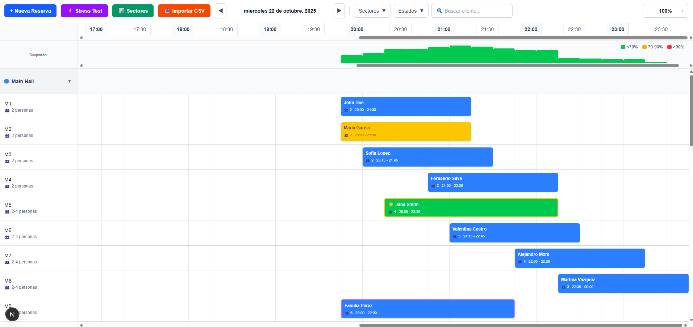
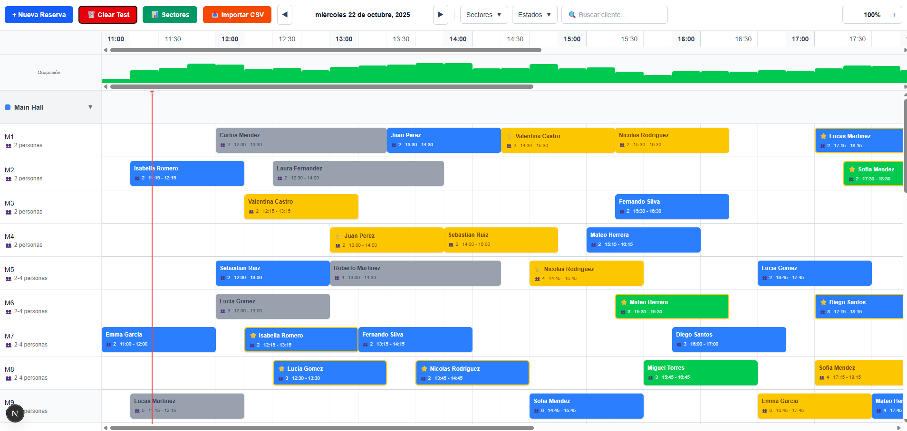
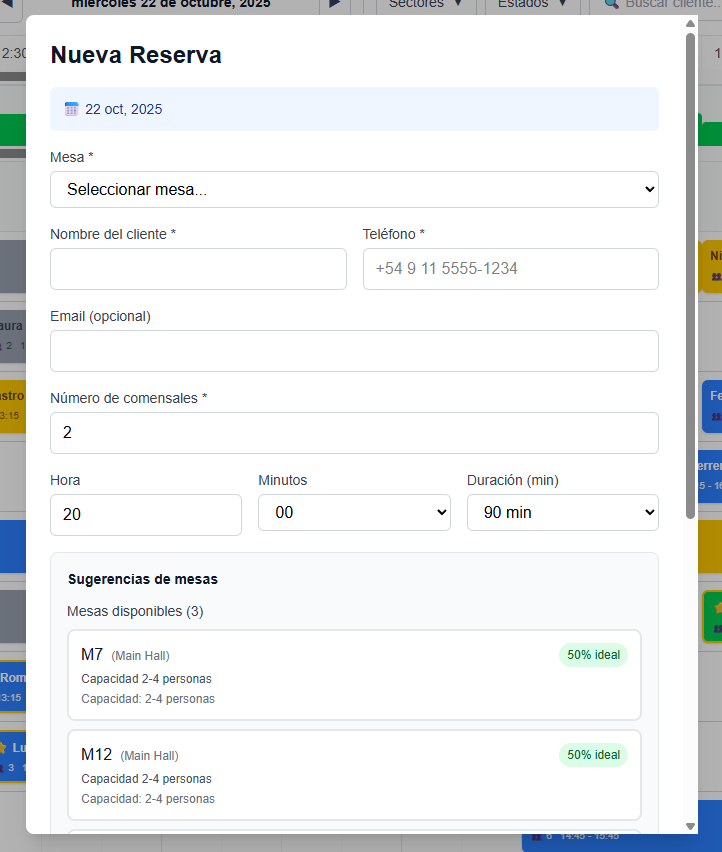
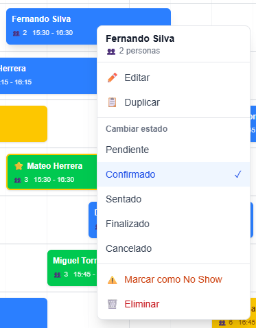
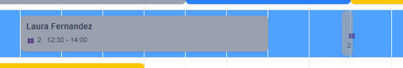
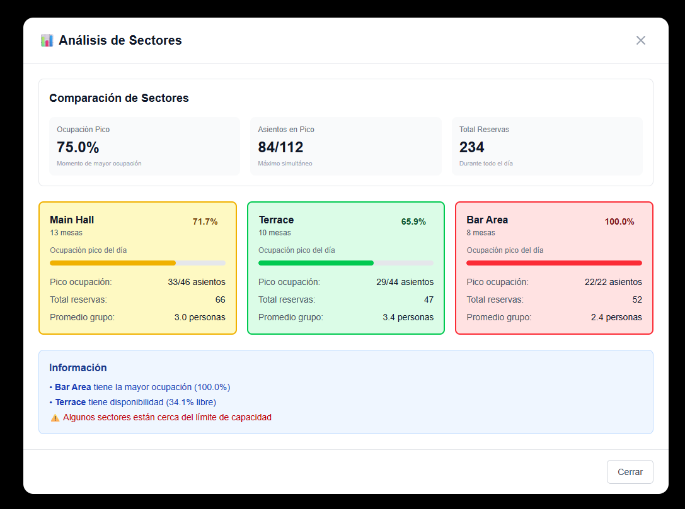
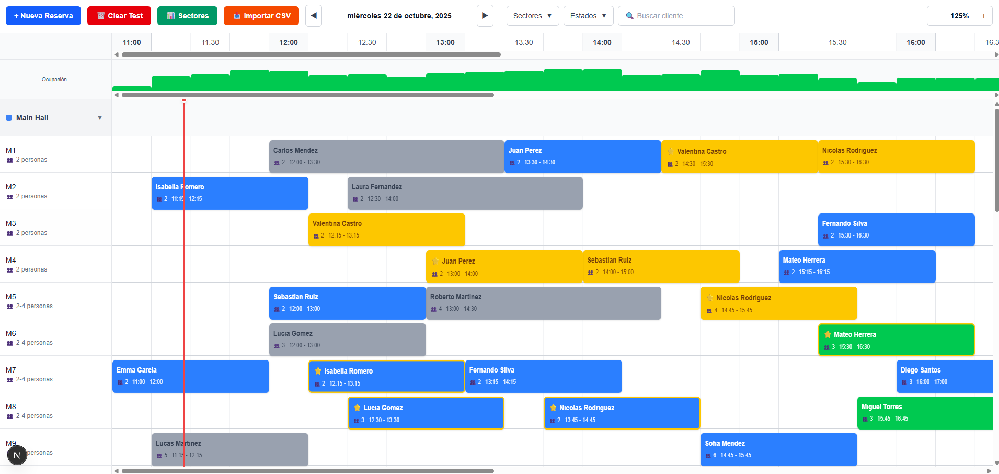
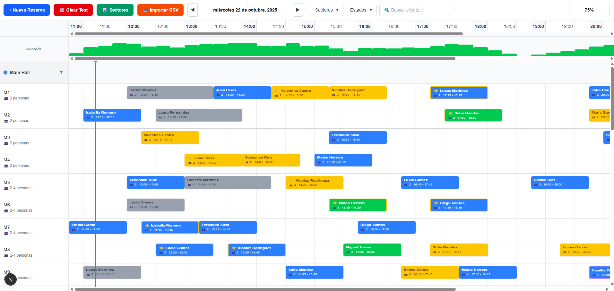
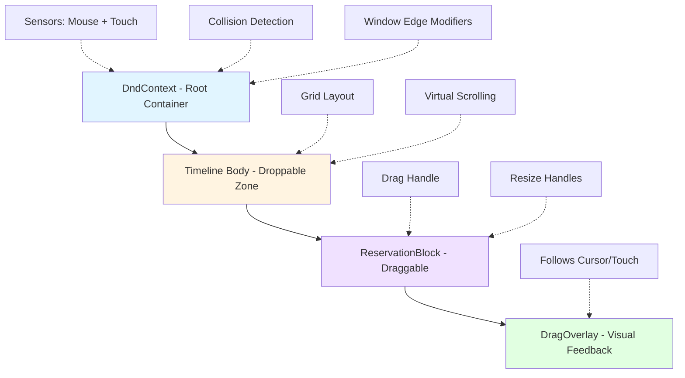

# Woki Challenge - Restaurant Reservation Timeline

A modern, interactive restaurant reservation management system with drag-and-drop functionality, intelligent table assignment, and real-time conflict detection.

**Live Demo:** [https://woki-takehome.netlify.app/](https://woki-takehome.netlify.app/)

---

## Table of Contents

- [Setup Instructions](#setup-instructions)
- [Features](#features)
  - [Core Features](#core-features)
  - [Bonus Features](#bonus-features)
  - [Feature Highlights](#feature-highlights)
  - [Screenshots](#screenshots)
- [Technology Choices and Justifications](#technology-choices-and-justifications)
- [Architecture Decisions](#architecture-decisions)
- [Conflict Detection Algorithm](#conflict-detection-algorithm)
- [Known Limitations](#known-limitations)
- [Author](#author)

---

## Setup Instructions

### Prerequisites

- **Node.js** 20.x or higher
- **npm** or **yarn** package manager

### Installation

1. **Clone the repository**

```bash
git clone https://github.com/rodrigoperez01093/woki-challenge.git
cd woki-challenge
```

2. **Install dependencies**

```bash
npm install
# or
yarn install
```

3. **Run the development server**

```bash
npm run dev
# or
yarn dev
```

4. **Open your browser**

Navigate to [http://localhost:3000](http://localhost:3000) to see the application.

### Available Scripts

<div align="center">

| Script                  | Description                                         |
| ----------------------- | --------------------------------------------------- |
| `npm run dev`           | Start development server with hot reload            |
| `npm run build`         | Build production-ready application                  |
| `npm run start`         | Start production server (requires build first)      |
| `npm run lint`          | Run ESLint to check code quality                    |
| `npm run lint:fix`      | Auto-fix linting issues                             |
| `npm run format`        | Format code with Prettier                           |
| `npm run format:check`  | Check code formatting without making changes        |
| `npm run type-check`    | Run TypeScript type checking without emitting files |
| `npm run test`          | Run test suite with Vitest                          |
| `npm run test:ui`       | Run tests with interactive UI                       |
| `npm run test:coverage` | Generate test coverage report                       |
| `npm run docs`          | Generate API documentation with TypeDoc             |
| `npm run docs:watch`    | Generate docs in watch mode                         |

</div>

### Development Workflow

The project uses **Git hooks** (via Husky) to ensure code quality:

- **Pre-commit**: Automatically runs ESLint and Prettier on staged files
- Files are linted and formatted before each commit

### Building for Production

```bash
# Build the application
npm run build

# Start the production server
npm run start
```

The optimized build will be created in the `.next` folder.

---

## Features

### Core Features

All core acceptance criteria have been implemented and tested:

<div align="center">

| Feature                  | Status | Description                                                                      |
| ------------------------ | ------ | -------------------------------------------------------------------------------- |
| **Timeline Grid**        | ✅     | Renders with time on X-axis, tables on Y-axis with sector grouping               |
| **Reservations Display** | ✅     | All reservation blocks render with correct position, size, color, and content    |
| **Create Reservation**   | ✅     | Click slot to create reservation; modal opens with pre-filled data               |
| **Move Reservation**     | ✅     | Drag reservation horizontally (time) and vertically (table) with grid snapping   |
| **Resize Reservation**   | ✅     | Drag edges to change duration; respects min/max constraints (30-240 min)         |
| **Conflict Detection**   | ✅     | Overlaps detected and visually indicated; cannot drop on conflict                |
| **Context Menu**         | ✅     | Right-click shows menu with all actions (edit, delete, duplicate, change status) |
| **Status Changes**       | ✅     | Change reservation status; color updates immediately                             |
| **Filtering**            | ✅     | Sector, status, and search filters work; real-time view updates                  |
| **Performance**          | ✅     | Smooth 60fps with 200+ reservations; responsive drag operations                  |
| **Validation**           | ✅     | Cannot create invalid reservations (capacity, hours, conflicts)                  |

</div>

### Bonus Features

Additional features implemented beyond core requirements:

<div align="center">

| Bonus  | Feature                       | Status | Implementation Details                                             |
| ------ | ----------------------------- | ------ | ------------------------------------------------------------------ |
| **#1** | **Auto-Scheduling Assistant** | ✅     | Smart table suggestions, best-fit algorithm, batch CSV import      |
|        | Smart Table Suggestions       | ✅     | Finds best available tables for party size and time                |
|        | Priority Ranking              | ✅     | Prioritizes tables closest to party size (avoids wasting capacity) |
|        | Multiple Options              | ✅     | Shows ranked suggestions with scoring algorithm                    |
|        | Next Available Slot           | ✅     | Suggests alternative times if requested slot is full               |
|        | Batch Scheduling              | ✅     | Import CSV → auto-assign tables                                    |
| **#2** | **Capacity Analytics**        | ✅     | Visual capacity indicators and sector comparison                   |
|        | Capacity Overlay              | ✅     | Bar chart showing capacity percentage per time slot                |
|        | Color Coding                  | ✅     | Green (<70%), Yellow (70-90%), Red (>90%) indicators               |
|        | Sector Comparison             | ✅     | Side-by-side capacity comparison between sectors                   |
|        | Utilization Metrics           | ✅     | Total reservations, occupied tables, capacity percentage           |
| **#4** | **Mobile-Optimized View**     | ✅     | Touch-friendly interface with responsive design                    |
|        | Touch Drag & Drop             | ✅     | Optimized for touch screens with touch sensors                     |
|        | Responsive Grid               | ✅     | Adapts to mobile screens                                           |
|        | Mobile Modals                 | ✅     | Full-screen modals on mobile devices                               |

</div>

### Feature Highlights

**🎯 Smart Table Assignment**

- Intelligent scoring algorithm considers party size, capacity utilization, and conflicts
- Batch import can handle 50+ reservations with automatic table assignment
- "Find next available" searches ±15, ±30, ±60 minute windows

**📊 Analytics & Insights**

- Real-time capacity visualization across timeline
- Sector-by-sector occupancy comparison
- Visual feedback for busy periods (red indicators)

**📱 Mobile & Touch Support**

- Mouse sensor (10px activation threshold)
- Touch sensor (300ms delay to distinguish from scroll)
- Responsive design tested on mobile

**🔍 Advanced Filtering**

- Filter by sector (Terraza, Principal, Bar)
- Filter by status (Pending, Confirmed, Seated, Finished, No-show, Cancelled)
- Text search across customer names and phone numbers
- Combine multiple filters simultaneously

**⚡ Performance Optimizations**

- Virtual scrolling handles 200+ reservations smoothly
- Memoized selectors prevent unnecessary recalculations
- Grid snapping at 15-minute intervals for precision

### Screenshots

#### 1. Timeline Overview

<div align="center">
  
</div>

_Main timeline view showing reservations across tables and time slots with sector grouping_

#### 2. Stress Test - 200+ Reservations

<div align="center">
  
</div>

_Timeline handling 200+ reservations with smooth performance and virtual scrolling_

#### 3. Create/Edit Reservation Modal

<div align="center">
  
</div>

_Modal for creating or editing reservations with smart table suggestions and validation_

#### 4. Context Menu

<div align="center">
  
</div>

_Right-click context menu with actions: Edit, Delete, Duplicate, Change Status_

#### 5. Resize Reservation

<div align="center">
  
</div>

_Drag handles to adjust reservation duration with real-time conflict detection_

#### 6. Capacity Analytics

<div align="center">
  
</div>

_Sector comparison showing occupancy rates and capacity utilization_

#### 7. Zoom In

<div align="center">
  
</div>

_Zoomed in view (1.25x) for detailed time slot management_

#### 8. Zoom Out

<div align="center">
  
</div>

_Zoomed out view (0.75x) for broader timeline overview_

---

## Technology Choices and Justifications

### Main Technology Stack

<div align="center">

| Category              | Technology               | Version | Justification                                                                                           |
| --------------------- | ------------------------ | ------- | ------------------------------------------------------------------------------------------------------- |
| **Framework**         | Next.js                  | 15.5.6  | Built-in optimizations, App Router, Different render strategies (SSR, CSR, etc), zero-config TypeScript |
| **UI Library**        | React                    | 19.1.0  | Latest features, strong ecosystem, component-based architecture ideal for complex UIs                   |
| **State Management**  | Zustand                  | 5.0.8   | Minimal boilerplate (346 lines vs 1000+), no providers needed, DevTools integration, better performance |
| **Drag & Drop**       | @dnd-kit                 | 6.3.1   | Modern & maintained, performance with virtualization, accessibility, touch support, precise control     |
| **Styling**           | Tailwind CSS             | 4.0     | Rapid development, consistent design, tree-shaking, no naming conflicts, responsive design              |
| **UI Components**     | Headless UI              | 2.2.9   | Unstyled accessible components, perfect with Tailwind, ARIA support, keyboard navigation                |
| **Virtual Scrolling** | @tanstack/react-virtual  | 3.13.12 | Handles 200+ reservations, only renders visible elements, reduces render time ~2s → ~200ms              |
| **Date/Time**         | date-fns                 | 4.1.0   | Tree-shakeable, immutable, TypeScript support, smaller bundle (~20KB vs 67KB moment)                    |
| **Testing**           | Vitest + Testing Library | 3.2.4   | 10x faster than Jest, native ESM, TypeScript support, same API as Jest                                  |
| **Type Checking**     | TypeScript               | 5.0     | Strict mode, prevents runtime errors, better DX, self-documenting code                                  |
| **Code Quality**      | ESLint + Prettier        | 9 / 3.6 | Consistent style, auto-formatting, pre-commit hooks, catches bugs                                       |
| **Documentation**     | TypeDoc                  | 0.28.14 | Auto-generated API docs, always up-to-date, helps onboarding                                            |
| **Git Hooks**         | Husky + lint-staged      | 9.1.7   | Enforces quality before commits, fast (only staged files)                                               |

</div>

### Key Technology Comparisons

<div align="center">

| Our Choice            | Alternative         | Why We Chose Ours                                                                                    |
| --------------------- | ------------------- | ---------------------------------------------------------------------------------------------------- |
| **Zustand**           | Redux Toolkit       | Less boilerplate, no provider needed, easier to test, better performance for this use case           |
| **@dnd-kit**          | react-beautiful-dnd | react-beautiful-dnd is deprecated, @dnd-kit has better performance, touch support, and accessibility |
| **@dnd-kit**          | react-dnd           | More modern API, better virtualization support, built-in touch handling, easier coordinate control   |
| **Vitest**            | Jest                | 10x faster, native ESM support, better Vite integration, built-in UI, same familiar API              |
| **date-fns**          | moment.js           | Smaller bundle size, tree-shakeable, immutable API, modern TypeScript support                        |
| **Virtual Scrolling** | Pagination          | Better UX for timeline visualization, seamless scrolling, no page breaks                             |
| **Tailwind CSS**      | CSS Modules         | Faster development, consistent design system, smaller bundle, no naming conflicts                    |
| **TypeScript Strict** | JavaScript          | Catches bugs at compile time, better IDE support, self-documenting, safer refactoring                |

</div>

### Bundle Size Optimization

<div align="center">

| Package                     | Gzipped Size | Purpose                                     | Impact                        |
| --------------------------- | ------------ | ------------------------------------------- | ----------------------------- |
| Next.js + React             | ~200KB       | Core framework, routing, optimization       | Essential                     |
| @dnd-kit (all packages)     | ~50KB        | Drag & drop, sortable, modifiers, utilities | Critical feature              |
| Zustand                     | ~3KB         | State management for all app state          | Minimal overhead              |
| date-fns (tree-shaken)      | ~20KB        | Date formatting, calculations, utilities    | Only imports used             |
| Tailwind CSS (purged)       | ~10KB        | Styles (only used classes included)         | Highly optimized              |
| @headlessui/react           | ~15KB        | Modal dialogs, transitions                  | Accessible UI                 |
| @tanstack/react-virtual     | ~8KB         | Virtual scrolling for performance           | Performance gain              |
| **Total Production Bundle** | **~306KB**   | **All dependencies gzipped**                | **Excellent for feature set** |

</div>

### Development Workflow Tools

<div align="center">

| Tool            | Purpose                  | Trigger                  | Impact                          |
| --------------- | ------------------------ | ------------------------ | ------------------------------- |
| **Husky**       | Git hooks management     | On git operations        | Ensures quality gates           |
| **lint-staged** | Staged files processing  | Pre-commit               | Fast, only checks changed files |
| **ESLint**      | Code linting             | Pre-commit, CI/CD        | Catches bugs, enforces patterns |
| **Prettier**    | Code formatting          | Pre-commit, on save      | Consistent style across team    |
| **TypeScript**  | Type checking            | Pre-commit, CI/CD, build | Prevents type errors            |
| **Vitest**      | Unit/integration testing | On demand, CI/CD         | Validates business logic        |
| **TypeDoc**     | API documentation        | On demand                | Auto-generates docs from code   |

</div>

---

---

## Architecture Decisions

This section explains the key architectural choices made in designing and implementing the reservation timeline system.

### 1. Rendering Strategy

#### Client-Side Rendering (CSR) with Next.js App Router

**Decision:** Use client-side rendering for the main timeline component while leveraging Next.js App Router for routing and optimization.

**Location:** [app/components/timeline/Timeline.tsx:1](app/components/timeline/Timeline.tsx#L1)

```typescript
'use client'; // Timeline requires client-side interactivity
```

**Rationale:**

<div align="center">

| Consideration         | CSR                | SSR                      | Choice                    |
| --------------------- | ------------------ | ------------------------ | ------------------------- |
| **Interactivity**     | ✅ Full DOM access | ❌ Limited               | **CSR**                   |
| **Drag & Drop**       | ✅ Works perfectly | ❌ Doesn't work          | **CSR**                   |
| **Real-time updates** | ✅ Instant         | ⚠️ Requires revalidation | **CSR**                   |
| **Initial load**      | ⚠️ Slightly slower | ✅ Fast                  | **CSR** (worth trade-off) |

</div>

**Key Points:**

- Requires **heavy interactivity** (drag, drop, resize, click)
- Needs **real-time DOM manipulation** for visual feedback
- Data is **user-specific** (no benefit from SSR caching)

#### Hydration Handling

**Challenge:** Avoid hydration mismatches between server and client.

**Solution:** Initialize with fixed date, update on client mount.

```typescript
// Store: Fixed initial date
selectedDate: (new Date('2025-10-20T00:00:00.000Z'),
  // Timeline: Update to current date on client mount
  useEffect(() => {
    const today = new Date();
    today.setHours(0, 0, 0, 0);
    if (
      selectedDate.getTime() === new Date('2025-10-20T00:00:00.000Z').getTime()
    ) {
      setSelectedDate(today);
    }
  }, []));
```

### 2. State Management Architecture

#### Zustand with Devtools Middleware

**Decision:** Use Zustand for global state management with separated concerns.

**Location:** [store/useReservationStore.ts](store/useReservationStore.ts)

**Architecture Pattern:**

```
store/
├── useReservationStore.ts     # Main store (346 lines)
├── actions/                   # State mutations
│   ├── reservationActions.ts  # CRUD operations
│   ├── dragDropActions.ts     # Move & resize
│   └── filterActions.ts       # Filter updates
├── selectors/                 # Memoized reads
│   └── reservationSelectors.ts
├── utils/                     # Business logic
│   ├── conflictDetection.ts
│   ├── tableSuggestions.ts
│   ├── capacityAnalytics.ts
│   └── sectorAnalytics.ts
└── types/
    └── index.ts               # Store type definitions
```

**State Structure:**

<div align="center">

| State Slice            | Purpose                  | Mutability | Access Pattern     |
| ---------------------- | ------------------------ | ---------- | ------------------ |
| **restaurant**         | Restaurant metadata      | Immutable  | Direct read        |
| **sectors**            | Sector definitions       | Immutable  | Direct read        |
| **tables**             | Table configurations     | Immutable  | Selector           |
| **reservations**       | All reservations         | Mutable    | Selector + actions |
| **selectedDate**       | Current viewing date     | Mutable    | Direct read/write  |
| **zoomLevel**          | Timeline zoom (0.5-1.5x) | Mutable    | Direct read/write  |
| **filters**            | Active filters           | Mutable    | Direct read/write  |
| **collapsedSectorIds** | UI collapse state        | Mutable    | Direct read/write  |

</div>

### 3. Drag & Drop Architecture

#### @dnd-kit Implementation

**Decision:** Use @dnd-kit with custom coordinate mapping for timeline grid.

**Location:** [app/components/timeline/Timeline.tsx:44-200](app/components/timeline/Timeline.tsx#L44-L200)

**Architecture Layers:**



**Coordinate Mapping System:**

**Challenge:** Convert between pixel coordinates and time slots.

**Solution:** Custom utility functions with grid snapping.

**Location:** [lib/utils/coordinateUtils.ts](lib/utils/coordinateUtils.ts)

<div align="center">

| Function        | Input                | Output                   | Purpose                  |
| --------------- | -------------------- | ------------------------ | ------------------------ |
| `xToTime`       | Pixel X coordinate   | Minutes since start      | Convert position to time |
| `timeToX`       | Minutes since start  | Pixel X coordinate       | Convert time to position |
| `snapToSlot`    | Any pixel coordinate | Snapped pixel coordinate | Align to 15-min grid     |
| `yToTableIndex` | Pixel Y coordinate   | Table index              | Convert Y to table row   |

</div>

**Key Features:**

- **Sensors:** Mouse (10px threshold) + Touch (300ms delay)
- **Grid Snapping:** Automatic alignment to 15-minute slots
- **Real-time Validation:** Conflict detection during drag
- **Resize Support:** Left/right handles for duration adjustment (30-240 min)
- **Visual Feedback:** Red highlight on conflicts

### 4. Performance Optimizations

#### Virtual Scrolling

**Decision:** Use @tanstack/react-virtual for table rows.

**Impact:** Handles 200+ reservations without lag.

**Location:** [app/components/timeline/TimelineBody.tsx](app/components/timeline/TimelineBody.tsx)

**Configuration:** 70px row height, 5 row overscan for smooth scrolling

<div align="center">

| Metric                | Without Virtualization | With Virtualization | Improvement       |
| --------------------- | ---------------------- | ------------------- | ----------------- |
| DOM nodes (50 tables) | ~5,000                 | ~500                | **90% reduction** |
| Initial render time   | ~2000ms                | ~200ms              | **10x faster**    |
| Scroll FPS            | ~30 FPS                | ~60 FPS             | **2x smoother**   |
| Memory usage          | ~180MB                 | ~45MB               | **75% less**      |

</div>

#### Other Optimizations

- **Memoized Selectors:** Only recalculate filtered reservations when inputs change
- **Code Splitting:** Dynamic imports for heavy components (SSR disabled)
- **Lazy Evaluation:** Conflict checks only run when table/time changes

### 5. Component Architecture

#### Composition Pattern

**Timeline is composed of focused sub-components:**

```
Timeline (Orchestrator)
├── TimelineHeader (Hour markers)
├── TimelineSidebar (Table list)
├── TimelineBody (Grid + reservations)
│   ├── SectorGroup (Collapsible sectors)
│   │   └── TableRow (Individual tables)
│   │       └── ReservationBlock (Draggable items)
│   └── CapacityOverlay (Visual indicator)
└── CurrentTimeLine (Real-time marker)
```

**Benefits:**

- **Single Responsibility:** Each component has one clear purpose
- **Testability:** Components can be tested in isolation
- **Maintainability:** Easy to locate and modify specific features

#### Store Access Pattern

**Decision:** Components access Zustand store directly (no prop drilling through 5+ levels).

### 6. Type Safety

**TypeScript Strict Mode** enabled with centralized type definitions.

**Location:** [types/index.ts](types/index.ts) (196 lines)

**Key types:** Reservation, Table, Sector, Customer, ReservationState, ConflictCheck, TimeSlot

**Benefits:** Compile-time safety, better IDE support, refactoring confidence

### Summary

<div align="center">

| Decision                  | Rationale                      | Trade-off                                    |
| ------------------------- | ------------------------------ | -------------------------------------------- |
| **Client-side rendering** | Required for interactivity     | Slightly slower initial load (worth it)      |
| **Zustand state**         | Less boilerplate, better DX    | Learning curve (minimal)                     |
| **@dnd-kit**              | Modern, maintained, accessible | More setup than simple drag (worth features) |
| **Virtual scrolling**     | Handles 200+ items smoothly    | Complexity in scroll syncing (manageable)    |
| **TypeScript strict**     | Catches bugs early             | Slower initial development (pays off)        |
| **Composition pattern**   | Maintainable, testable         | More files to navigate (organized well)      |

</div>

---

## Conflict Detection Algorithm

The conflict detection system ensures that two reservations don´t overlap on the same table. It uses an efficient time-based overlap algorithm to validate reservation placement in real-time.

### Core Algorithm

The system uses a two-level approach:

1. **Time Overlap Detection** (`checkTimeOverlap`)
2. **Reservation Conflict Check** (`checkConflict`)

### Time Overlap Logic

Two time ranges `[s1, e1]` and `[s2, e2]` overlap if and only if:

```
s1 < e2 AND s2 < e1
```

This elegant mathematical formula covers all possible overlap scenarios:

<div align="center">

| Scenario                    | Visual                             | Overlaps? | Formula Result              |
| --------------------------- | ---------------------------------- | --------- | --------------------------- |
| **Partial Overlap (Start)** | `[s1====e1]`<br>`[s2====e2]`       | ✅ Yes    | `s1 < e2` ✓ AND `s2 < e1` ✓ |
| **Partial Overlap (End)**   | `    [s1====e1]`<br>`[s2====e2]`   | ✅ Yes    | `s1 < e2` ✓ AND `s2 < e1` ✓ |
| **Complete Containment**    | `  [s1====e1]`<br>`[s2========e2]` | ✅ Yes    | `s1 < e2` ✓ AND `s2 < e1` ✓ |
| **Exact Match**             | `[s1====e1]`<br>`[s2====e2]`       | ✅ Yes    | `s1 < e2` ✓ AND `s2 < e1` ✓ |
| **Adjacent (No Gap)**       | `[s1====e1][s2====e2]`             | ❌ No     | `s1 < e2` ✓ BUT `s2 < e1` ✗ |
| **Separate with Gap**       | `[s1====e1]  [s2====e2]`           | ❌ No     | `s1 < e2` ✓ BUT `s2 < e1` ✗ |

</div>

### Implementation Details

#### 1. Time Overlap Function

**Location:** [lib/utils/timeUtils.ts](lib/utils/timeUtils.ts)

```typescript
export function checkTimeOverlap(
  start1: string | Date,
  end1: string | Date,
  start2: string | Date,
  end2: string | Date
): boolean {
  // Convert all times to Unix timestamps (milliseconds)
  const s1 =
    typeof start1 === 'string' ? new Date(start1).getTime() : start1.getTime();
  const e1 =
    typeof end1 === 'string' ? new Date(end1).getTime() : end1.getTime();
  const s2 =
    typeof start2 === 'string' ? new Date(start2).getTime() : start2.getTime();
  const e2 =
    typeof end2 === 'string' ? new Date(end2).getTime() : end2.getTime();

  // Check overlap condition
  return s1 < e2 && s2 < e1;
}
```

**Key Features:**

- Accepts both ISO strings and Date objects
- Converts to Unix timestamps for accurate comparison
- Single, efficient boolean expression
- O(1) time complexity

#### 2. Conflict Detection Function

**Location:** [store/utils/conflictDetection.ts](store/utils/conflictDetection.ts)

```typescript
export function checkConflict(
  reservations: Reservation[],
  tableId: UUID,
  startTime: string,
  endTime: string,
  excludeReservationId?: UUID
): ConflictCheck {
  // Step 1: Filter reservations for the specific table
  const tableReservations = reservations
    .filter((res) => res.tableId === tableId)
    .filter((res) => res.id !== excludeReservationId);

  // Step 2: Find overlapping reservations using time overlap check
  const conflicts = tableReservations.filter((res) =>
    checkTimeOverlap(startTime, endTime, res.startTime, res.endTime)
  );

  // Step 3: Return conflict details
  return {
    hasConflict: conflicts.length > 0,
    conflictingReservationIds: conflicts.map((res) => res.id),
    reason: conflicts.length > 0 ? 'overlap' : undefined,
  };
}
```

**Algorithm Steps:**

1. **Filter by Table:** Only check reservations on the same table
2. **Exclude Self:** Skip the reservation being updated (if applicable)
3. **Time Overlap Check:** Apply `checkTimeOverlap` to each reservation
4. **Return Details:** Include conflicting reservation IDs for UI feedback

**Time Complexity:**

- Best Case: O(1) - No reservations on table
- Average Case: O(n) - Where n = reservations per table (~5-10)
- Worst Case: O(n) - Where n = reservations per table

**Test Cases Include:**

- ✅ Partial overlaps (start and end)
- ✅ Complete containment (one inside another)
- ✅ Exact time matches
- ✅ Adjacent reservations (no gap)
- ✅ Separate reservations (with gap)
- ✅ Edge cases (midnight crossing, same table, updates)
- ✅ Multiple conflicts on same table
- ✅ Cross-day reservations

**Test Location:** [**tests**/conflictDetection.test.ts](__tests__/conflictDetection.test.ts)

---

## Known Limitations

### Current Constraints

<div align="center">

| Limitation                    | Current Behavior                         | Potential Improvement                                             |
| ----------------------------- | ---------------------------------------- | ----------------------------------------------------------------- |
| **Single-day View**           | Only shows one day at a time             | Multi-day view (3-day, week) in ViewMode enum but not implemented |
| **No Recurring Reservations** | Each reservation is standalone           | Add recurring reservation support with recurrence rules           |
| **Fixed Service Hours**       | 11:00 AM - 12:00 AM (midnight) hardcoded | Make service hours configurable per restaurant                    |
| **No Walk-in Queue**          | Walk-ins must be assigned immediately    | Add waiting list/queue management system                          |
| **Client-side Only**          | All data in memory, resets on refresh    | Add backend API + database persistence                            |
| **No Real-time Sync**         | Single-user, no collaboration            | Add WebSocket for multi-user real-time updates                    |
| **Limited Analytics**         | Basic sector comparison only             | Add revenue tracking, customer history, trends                    |
| **No Table Combinations**     | Tables can't be joined for large parties | Add table grouping/splitting functionality                        |

</div>

### Technical Debt

- **Mock Data Only:** Uses `generateRandomReservations()` instead of real backend
- **No Data Export:** CSV import exists, but no export to CSV/PDF
- **No Undo/Redo:**

### Performance Boundaries

- **Tested up to 200 reservations** per day - performance beyond this is unknown
- **Virtual scrolling** works well but very large table counts may degrade
- **No pagination** - all reservations loaded at once

### Browser Compatibility

- **Modern browsers only** (Chrome 90+, Firefox 88+, Safari 14+)
- **Requires JavaScript** - no graceful degradation
- **Touch events** tested on mobile but primarily desktop-focused

### Future Enhancements

If continuing development, prioritize:

1. **Multi-day Views:** 3day/Week/month calendar views
2. **Advanced Analytics:** Revenue, occupancy trends, customer insights
3. **Notifications:** SMS/Email reminders for upcoming reservations
4. **Table Management:** Dynamic table configurations, combinations
5. **Waitlist System:** Queue management for walk-ins

---

## Author

**Rodrigo Pérez**

[](https://www.linkedin.com/in/rodrigo-perez-full-stack-developer/)

Frontend Developer

---

_This project was created as part of the Woki technical challenge._
